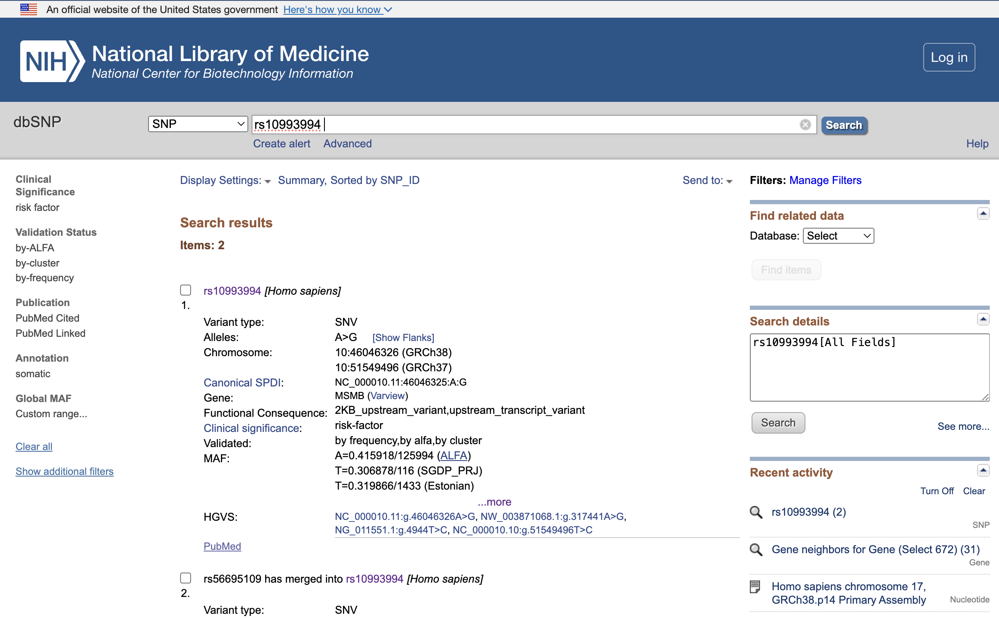

# Molecular Epidemiology Week 2 Practical
# Webtools for genetic epidemiology studies

Based on `Practical_Wk2_18102024.pdf` (18-Oct-2024 16:53:52)

- [Molecular Epidemiology Week 2 Practical](#molecular-epidemiology-week-2-practical)
- [Webtools for genetic epidemiology studies](#webtools-for-genetic-epidemiology-studies)
  - [NCBI](#ncbi)
    - [Q1. Find BRCA1 in NCBI link](#q1-find-brca1-in-ncbi-link)
      - [i. What are the other names of this gene?](#i-what-are-the-other-names-of-this-gene)
      - [ii. On which chromosome is this gene?](#ii-on-which-chromosome-is-this-gene)
      - [iii. What is the start and end position of the gene?](#iii-what-is-the-start-and-end-position-of-the-gene)
      - [iv. What are the neighbouring genes?](#iv-what-are-the-neighbouring-genes)
    - [Q2. Find rs10993994 in dbSNP link](#q2-find-rs10993994-in-dbsnp-link)
      - [i. What are the alleles?](#i-what-are-the-alleles)
      - [ii. What is the frequency of the A allele in KOREAN and Siberian population?](#ii-what-is-the-frequency-of-the-a-allele-in-korean-and-siberian-population)
      - [iii. Do you see a link to ClinVar? Which disease is associated with this SNP?](#iii-do-you-see-a-link-to-clinvar-which-disease-is-associated-with-this-snp)
      - [iv. Can you find the supporting papers?](#iv-can-you-find-the-supporting-papers)
  - [UCSC Genome Browser](#ucsc-genome-browser)
    - [Q3. Find rs10993994 in UCSC GRCh\*37 (hg19)](#q3-find-rs10993994-in-ucsc-grch37-hg19)
      - [i. Which chromosome is it on?](#i-which-chromosome-is-it-on)
      - [ii. Which gene is it located on?](#ii-which-gene-is-it-located-on)
      - [iii. What are the neighbour genes?](#iii-what-are-the-neighbour-genes)
  - [LD Link link](#ld-link-link)
    - [Q4. Make a regional plot for the association of rs10993994 with the risk of prostate cancer on with 500 kb window in the CEU population (please use the example data)](#q4-make-a-regional-plot-for-the-association-of-rs10993994-with-the-risk-of-prostate-cancer-on-with-500-kb-window-in-the-ceu-population-please-use-the-example-data)
    - [Q5: In the CEU population,](#q5-in-the-ceu-population)
      - [i. Is there any evidence that rs10993994 is an Expression Quantitative Trait Locus (eQTL) in prostate?](#i-is-there-any-evidence-that-rs10993994-is-an-expression-quantitative-trait-locus-eqtl-in-prostate)
      - [ii. Is it an eQTL for MSMB?](#ii-is-it-an-eqtl-for-msmb)
      - [iii. What about other tissues?](#iii-what-about-other-tissues)
    - [Q6. Do rs1130864, rs1205 and rs3093068 make a haplotype in the CEU population ?](#q6-do-rs1130864-rs1205-and-rs3093068-make-a-haplotype-in-the-ceu-population-)
    - [Q7. Make a graph to show the LD across rs1130864, rs1205 and rs3093068 in the CEU population](#q7-make-a-graph-to-show-the-ld-across-rs1130864-rs1205-and-rs3093068-in-the-ceu-population)
    - [Q8. What is the LD between rs4948418 and rs10994415 in the CEU population?](#q8-what-is-the-ld-between-rs4948418-and-rs10994415-in-the-ceu-population)
    - [Q9. Compare the MAF of rs4988235 and rs145946881 in various populations. These two SNPs are related to lactose intolerance. Do you see any relevant pattern in the allele frequency?](#q9-compare-the-maf-of-rs4988235-and-rs145946881-in-various-populations-these-two-snps-are-related-to-lactose-intolerance-do-you-see-any-relevant-pattern-in-the-allele-frequency)
    - [Q10. Find a proxy for rs10993994 in the CEU population](#q10-find-a-proxy-for-rs10993994-in-the-ceu-population)
    - [Q11. Find traits/disease associated with rs295 in the CEU population](#q11-find-traitsdisease-associated-with-rs295-in-the-ceu-population)
    - [Q12. Prune the list of SNPs below. Use R2 \< 0.3 and MAF \> 0.01 in the CEU population.](#q12-prune-the-list-of-snps-below-use-r2--03-and-maf--001-in-the-ceu-population)

## NCBI
### Q1. Find BRCA1 in NCBI [link](https://www.ncbi.nlm.nih.gov/gene/672)
The [National Center for Biotechnology Information](https://www.ncbi.nlm.nih.gov/) advances science and health by providing access to biomedical and genomic information.

* select "Gene"
* enter gene name
* select record for Homo Sapiens (human) 

#### i. What are the other names of this gene?
From **Summary >> Also known as**, _IRIS; PSCP; BRCAI; BRCC1; FANCS; PNCA4; RNF53; BROVCA1; PPP1R53_.

#### ii. On which chromosome is this gene?
From **Genomic context >> Location**, _17q21.31_
* chromosome 17
* longer arm, q 
* band position 21.31
> cytogenetic location: <chromosome number (1-22, X, Y)><chromosome arm (shorter arm p, longer arm q)><band position on arm (higher number indicates greater distance from centromere)>.<sub-band position>
 [ref](https://medlineplus.gov/genetics/understanding/howgeneswork/genelocation/)

#### iii. What is the start and end position of the gene?
From **Genomic context >> Location for GRCh38.p14 reference build**, start/end positions on version NC_000017.11 of chromosome 17 (see [NC_000017.11 RefSeq](https://www.ncbi.nlm.nih.gov/nuccore/568815581)) are _43,044,295 to 43,125,364_.

#### iv. What are the neighbouring genes? 
From **right sidebar >> Related information >> Gene neighbours**, see [list of neighbours](https://www.ncbi.nlm.nih.gov/gene?LinkName=gene_gene_neighbors&from_uid=672). 

### Q2. Find rs10993994 in dbSNP [link](https://www.ncbi.nlm.nih.gov/snp/rs10993994)
NCBI single nucleotide polymorphism database ([dbSNP](https://www.ncbi.nlm.nih.gov/snp/)) contains human single nucleotide variations, microsatellites, and small-scale insertions and deletions along with publication, population frequency, molecular consequence, and genomic and RefSeq mapping information for both common variations and clinical mutations.

* enter rsID
* select record for Homo Sapiens

#### i. What are the alleles?
From **overview >> Alleles**, _A>G_. 

#### ii. What is the frequency of the A allele in KOREAN and Siberian population?
From **Frequency tab >> filter by study population**, frequency of A allele is _A=0.4474_ (Korean) and _A=0.33_ (Siberian). 

#### iii. Do you see a link to ClinVar? Which disease is associated with this SNP?
#### iv. Can you find the supporting papers?
From **Overview >> Clinical Significance: Reported in [ClinVar](https://www.ncbi.nlm.nih.gov/clinvar/variation/14244/?oq=((29283[AlleleID]))&m=NC_000010.11:g.46046326=) >> ClinVar Conditions/Submissions - Germline**, this SNP is associated with Prostate cancer, as shown in 5 publications on PubMed.

## UCSC Genome Browser
### Q3. Find rs10993994 in UCSC GRCh*37 (hg19)
The [UCSC Genome Browser](https://genome.ucsc.edu/index.html) is a web-based tool serving as a multi-powered microscope that allows researchers to view all 23 chromosomes of the human genome at any scale from a full chromosome down to an individual nucleotide. The Browser also affords access to the genomes of more than one hundred other organisms.

* Select reference build GRCh37/hg19
  
* Enter rsID
  
* View genomic region
  
* Click gene for details
  
* Click rsID for details
  

#### i. Which chromosome is it on?
_chr10_
#### ii. Which gene is it located on?
_MSMB_
#### iii. What are the neighbour genes?
After zooming out 1000x, _NCOA4_.

## LD Link [link](https://ldlink.nih.gov/?tab=home)
### Q4. Make a regional plot for the association of rs10993994 with the risk of prostate cancer on with 500 kb window in the CEU population (please use the example data)
LD Assoc - Interactively visualize association p-value results and linkage disequilibrium patterns for a genomic region of interest.
* use example GWAS data (prostate cancer, GRCh37)
* select variant (not region/gene)
* enter rsID and base pair window size
* select population 

Result:

### Q5: In the CEU population,
LD Express - Search if a list of variants (or variants in LD with those variants) is associated with gene expression in multiple tissue types.

#### i. Is there any evidence that rs10993994 is an Expression Quantitative Trait Locus (eQTL) in prostate?
> "SNP is an eQTL of gene" -> SNP is affecting expression of gene
> Expression quantitative trait loci (eQTL) are genetic loci that explain variation in expression levels of mRNAs. Another way to understand the effects of a genetic locus is to determine which gene is affected in specific tissues by studying eQTL. 
> A common approach for selecting nearby candidate genes for functional investigation is by performing an expression quantitative trait locus (eQTL) analysis. eQTL analyses identify germline variants associated with local gene expression by testing for a relationship between variant genotype and gene expression levels. While many gene expression datasets have been created, the Genotype-Tissue Expression (GTEx) project is the most comprehensive resource to date with expression data on 54 non-diseased tissue sites collected from nearly 1000 individuals. In addition to gene expression data, the GTEx project has publicly available dense genotype data on over 4.6 million variants for conducting eQTL analyses. ([LDexpress paper](https://pmc.ncbi.nlm.nih.gov/articles/PMC8686638/))

* enter rsID
* select population 
* select tissues

Results:
*yes*, this SNP is an eQTL of several genes in prostate tissue.

#### ii. Is it an eQTL for MSMB?
*yes*, p-value = 2e-16 is significant 

#### iii. What about other tissues?
*Lung, blood, brain, skin, artery, etc.*
* select "All tissues"

### Q6. Do rs1130864, rs1205 and rs3093068 make a haplotype in the CEU population ? 
LD Hap - Calculate population specific haplotype frequencies of all haplotypes observed for a list of query variants.
* enter rsIDs of interest on separate lines
* select population 

### Q7. Make a graph to show the LD across rs1130864, rs1205 and rs3093068 in the CEU population
> commonly used summaries for LD are D' and r2 have been calculated.
> D' is the difference between the observed and the expected frequency of a given haplotype. If two loci are independent (i.e. in linkage equilibrium and therefore not coinherited at all), the D' value will be 0. 
> r2 is the correlation between a pair of loci.

LD Matrix - Create an interactive heatmap matrix of pairwise linkage disequilibrium statistics.

* High D': often inherited together
* Low R^2: poor predictors of each other (low variance explained)

### Q8. What is the LD between rs4948418 and rs10994415 in the CEU population? 
LD Pair - Investigate correlated alleles for a pair of variants in high LD.
* enter 2 rsIDs
* select population 

### Q9. Compare the MAF of rs4988235 and rs145946881 in various populations. These two SNPs are related to lactose intolerance. Do you see any relevant pattern in the allele frequency? 
LD Pop - Investigate allele frequencies and linkage disequilibrium patterns across 1000G populations.
* enter 2 rsIDs
* select "All populations"
* view maps for LD by region, and minor allele frequency by region

### Q10. Find a proxy for rs10993994 in the CEU population
LD Proxy  - Interactively explore proxy and putatively functional variants for a query variant.
* enter rsID
* select population

 

### Q11. Find traits/disease associated with rs295 in the CEU population 
LD Trait - Search if a list of variants (or variants in LD with those variants) have previously been associated with a trait or disease.
* enter rsID
* select population
* view traits, beta/OR + p-value, papers identified by PMID, data links from GWAS catalog

### Q12. Prune the list of SNPs below. Use R2 < 0.3 and MAF > 0.01 in the CEU population. 
> rs10437339
> rs11265257
> rs11265260
> rs11265263
> rs11588887
> rs11589667
> rs1205 

SNPClip - Prune a list of variants by linkage disequilibrium.

* enter list of rsID on separate lines
* select population 
* view explanations for keeping/removing variants

* view variants with warnings

