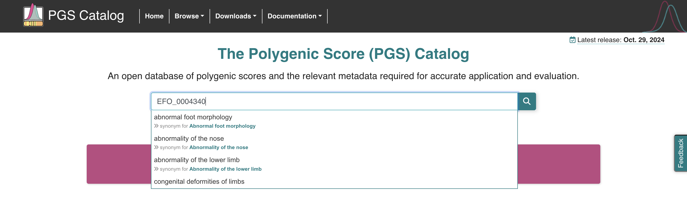
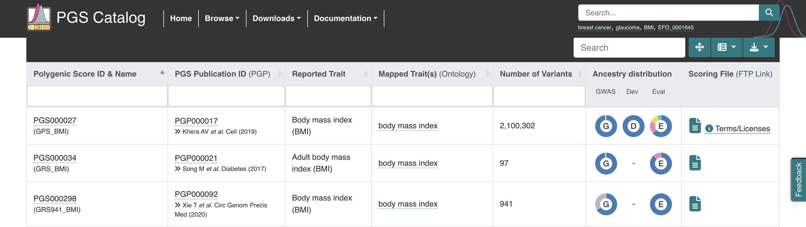

# Molecular Epidemiology Week 4 Practical
# Polygenic risk scores
This is part 2 of the practical session. Part 1 is on Post-GWAS analysis with FUMA. 

Based on `Week_4_sorted/Practical/PGS/Questions_with_code.pdf` (29-Oct-2024 16:08:41)

- [Molecular Epidemiology Week 4 Practical](#molecular-epidemiology-week-4-practical)
- [Polygenic risk scores](#polygenic-risk-scores)
  - [PRS for **Testosterone** in CHB+JPT population](#prs-for-testosterone-in-chbjpt-population)
    - [\[1\] Data preparation](#1-data-preparation)
    - [\[2\] Calculate a Polygenic Risk Score (PGS) for testosterone](#2-calculate-a-polygenic-risk-score-pgs-for-testosterone)
    - [\[3\] Is the PGS for testosterone higher in males compared to females? Test for statistical significance using R.](#3-is-the-pgs-for-testosterone-higher-in-males-compared-to-females-test-for-statistical-significance-using-r)
        - [what does `testosterone_sex.R` do?](#what-does-testosterone_sexr-do)
        - [Option 1: run individual lines of R code in R shell](#option-1-run-individual-lines-of-r-code-in-r-shell)
        - [Option 2: run entire R program](#option-2-run-entire-r-program)
  - [\[4\] PRS for **BMI** in CHB+JPT population](#4-prs-for-bmi-in-chbjpt-population)
    - [\[4a\] Search for BMI PGS on PGS Catalog. Select the PGS containing 941 variants from the paper published in 2020 by Xie T. et al. (EFO\_0004340)](#4a-search-for-bmi-pgs-on-pgs-catalog-select-the-pgs-containing-941-variants-from-the-paper-published-in-2020-by-xie-t-et-al-efo_0004340)
    - [\[4b\] Download the scoring file, harmonized version, GRCh37 and unzip the file PGS000298\_hmPOS\_GRCh37.txt.gz.](#4b-download-the-scoring-file-harmonized-version-grch37-and-unzip-the-file-pgs000298_hmpos_grch37txtgz)
    - [\[4c\] Re-format the scoring file to meet the format requested by the PLINK function `--score`](#4c-re-format-the-scoring-file-to-meet-the-format-requested-by-the-plink-function---score)
    - [\[4d\] Run the PGS as before. How many variants were included?](#4d-run-the-pgs-as-before-how-many-variants-were-included)
    - [Using R,](#using-r)
    - [\[4e\] Compare the PGS to the actual BMI provided in the file `hapmap_JPT_CHB_BMI.txt`. What is the correlation?](#4e-compare-the-pgs-to-the-actual-bmi-provided-in-the-file-hapmap_jpt_chb_bmitxt-what-is-the-correlation)
    - [\[4f\] Plot the PGS versus actual BMI](#4f-plot-the-pgs-versus-actual-bmi)
    - [\[4g\] Plot the proportion of overweight people (BMI\>25) per decile of PGS](#4g-plot-the-proportion-of-overweight-people-bmi25-per-decile-of-pgs)
  - [Follow-up questions](#follow-up-questions)
      - [Q1. Why does the PGS for testosterone have both positive and negative values, while the PGS for BMI only has positive values?](#q1-why-does-the-pgs-for-testosterone-have-both-positive-and-negative-values-while-the-pgs-for-bmi-only-has-positive-values)
      - [Q2. What was the ancestry of the participants in the original GWAS used to build these PGSs and does it match the population you were working on here? How does this impact the PGS?](#q2-what-was-the-ancestry-of-the-participants-in-the-original-gwas-used-to-build-these-pgss-and-does-it-match-the-population-you-were-working-on-here-how-does-this-impact-the-pgs)
      - [Q3. Which method was used by the authors to build the testosterone PGS? Are the weights reported in the score file same as the GWAS beta estimates?](#q3-which-method-was-used-by-the-authors-to-build-the-testosterone-pgs-are-the-weights-reported-in-the-score-file-same-as-the-gwas-beta-estimates)

## PRS for **Testosterone** in CHB+JPT population
### [1] Data preparation 
<!-- XY are security flags: https://unix.stackexchange.com/questions/390779/is-x-redundant-if-y-is-also-specified-when-running-ssh -->

1. Connect to HPC and create folders for this practical
  ```
  ssh -XY USERNAME@login.hpc.imperial.ac.uk
  mkdir molec_w4
  cd molec_w4
  ```
3. Download data files from Blackboard 
   * `hapmap_JPT_CHB_BMI.txt`: phenotype data of BMI 
   * `score_file_testosterone.txt`: scoring file of testosterone to HPC
4. In a new command line window, copy data files to HPC [1.1]
  ```
  cd ...Practical/PGS/data
  scp * USERNAME@login.hpc.imperial.ac.uk:molec_w4
  ```
5. Download HapMap genotype data for Han Chinese in Beijing (CHB) and Japanese in Tokyo (JPT) populations as PLINK binary filesets [1.2]
  ```
  wget https://zzz.bwh.harvard.edu/plink/dist/hapmap_JPT_CHB_r23a_filtered.zip
  unzip hapmap_JPT_CHB_r23a_filtered.zip 
  rm hapmap_JPT_CHB_r23a_filtered.zip 
  ```
   * I got this URL by visiting the [link](https://zzz.bwh.harvard.edu/plink/res.shtml) provided in the instructions, right-clicking "hapmap_JPT_CHB_r23a_filtered.zip", and copying link address
   * dataset info
     * JPT+CHB founders (release 23, 90 individuals, filtered 2.2 million SNPs)
     * filtered: smaller subset of SNPs with MAF >0.01 and genotyping rate >0.95 in the 60 CEU founders, good starting place for imputation in samples of European descent
     * SNPs are coded according NCBI build 36 coordinates on the forward strand
   * this should give us the binary fileset containing genotype data `.bed+.bim+.fam` (you can read more about how these files are structured [here](https://www.cog-genomics.org/plink/1.9/formats))


**CHECKPOINT:**
```
[USERNAME@login-c molec_w4]$ ls
hapmap_JPT_CHB_BMI.txt                  hapmap_JPT_CHB_r23a_filtered.fam
hapmap_JPT_CHB_r23a_filtered.bed        score_file_testosterone.txt
hapmap_JPT_CHB_r23a_filtered.bim
```

### [2] Calculate a Polygenic Risk Score (PGS) for testosterone
> Sinnott-Armstrong, N., Tanigawa, Y., Amar, D. et al. Genetics of 35 blood and urine biomarkers in the UK Biobank. Nat Genet 53, 185–194 (2021). https://doi.org/10.1038/s41588-020-00757-z
1. Load plink module
  ```
  module load plink
  ```
2. Calculate the PGS for testosterone levels by conducting **allelic scoring** with PLINK. See [docs for `--score`](https://www.cog-genomics.org/plink/1.9/score). 
  ```
  plink \
  --bfile hapmap_JPT_CHB_r23a_filtered \
  --score score_file_testosterone.txt sum double-dosage \
  --out testosterone_grs
  ```
   * `--bfile`: get genotype data from binary files (`.bed+.bim+.fam` ) from JPT/CHB HapMap 
   * `--score`: apply a simple linear scoring system to all genotypes 
     * e.g. to estimate genetic load, or apply additive effect estimates for a quantitative trait
     * input file should have one line per scored variant of tab-separated values (variant ID, allele code, score), e.g. "rs7538773   A   -0.0002389016"
   * `sum`: use sum to aggregate valid per-allele scores (cumulative effect of selected SNPs)
     * vs default: report average of valid per-allele scores as final score
     * depends on how score was defined, affects interpretation of final value (especially if predicting quantitative measure)
   * `double-dosage`: multiply scores by 0..2 if diploid allele counts are used in dataset
     * depends how data is recorded in input files
     * vs default: scores are multiplied by 0..1 dosages
   * `--out`: name of allelic scoring results output file (`.profile`)

```
[USERNAME@login-c molec_w4]$ head testosterone_grs.profile 
      FID       IID  PHENO    CNT   CNT2 SCORESUM
  NA18524   NA18524     -9   9038   3997 0.162557
  NA18526   NA18526     -9   9226   4060 0.0894966
  NA18529   NA18529     -9   9278   4142 0.0708026
  NA18532   NA18532     -9   9284   4023 0.00306491
  NA18537   NA18537     -9   9278   4089 0.104302
  NA18540   NA18540     -9   9086   3989 0.126225
  NA18542   NA18542     -9   9290   4040   0.1035
  NA18545   NA18545     -9   9230   4000 0.0825984
  NA18547   NA18547     -9   9284   4021 0.151574
```
[`.profile` docs](https://www.cog-genomics.org/plink/1.9/formats#profile)
* one line per sample
* `FID`: Family ID
* `IID`: Within-family ID
* `PHENO`: Phenotype value (-9 is used here as NA)
* `CNT`: # of nonmissing alleles used for scoring
* `CNT2`: Sum of named allele counts
* `SCORESUM`: Score calculated with weighted sum based on weights specified in score file and genotypes in binary fileset
  * by default, copies of unnamed alleles contribute zero to score
  * by default, missing genotypes contribute an amount proportional to the imputed allele frequency

### [3] Is the PGS for testosterone higher in males compared to females? Test for statistical significance using R.
##### what does `testosterone_sex.R` do?
```R
testosterone_grs <- read.table("testosterone_grs.profile", header = T)
```
* read the polygenic risk score we created in [step 2](#2-calculate-a-polygenic-risk-score-pgs-for-testosterone) to a dataframe `testosterone_grs`
* `header = T` (true) indicates to R that the file contains a header, and to use this for naming the columns of our dataframe
* columns: FID, IID, PHENO, CNT, CNT2, SCORESUM (see [step 2](#2-calculate-a-polygenic-risk-score-pgs-for-testosterone) or [PLINK `.profile` docs](https://www.cog-genomics.org/plink/1.9/formats#profile))

```R
testosterone_fam <- read.table("hapmap_JPT_CHB_r23a_filtered.fam")
```
* read the sample information file (`.fam`) for our dataset to a dataframe `testosterone_fam`
* columns in `.fam` file as per [PLINK docs](https://www.cog-genomics.org/plink/1.9/formats#fam)
  * FID: Family ID
  * IID: Within-family ID, cannot be 0 (0 is reserved as a special value for the next two fields)
  * Within-family ID of father, or '0' if father isn't in dataset
  * Within-family ID of mother, or '0' if mother isn't in dataset
  * Sex: '1' = male, '2' = female, '0' = unknown
  * Phenotype: '1' = control, '2' = case, '-9'/'0'/non-numeric = missing data if case/control
* however, since `.fam` files do not contain a header, R automatically names the columns V1, V2, ... V6 (you can verify this with `colnames(testosterone_fam)`)

```R
testosterone_grs <- merge(testosterone_grs, testosterone_fam[c("V1", "V5")], by.x = "FID", by.y = "V1")
```
see [R documentation on merge](https://www.rdocumentation.org/packages/base/versions/3.6.2/topics/merge)
* join the two dataframes, by matching the FID in both files (`FID` column for `testosterone_grs` + first column aka `V1` for `testosterone_fam`)
* we also want to keep the 5th column `V5` of `testosterone_fam`, which contains the sex data for each sample
* we have added the sex column from the `.fam` file to the risk score data in the `.profile` file by matching the family IDs of the individuals 
  
> **NOTE:** this approach of joining only by matching the FID only works because in our sample we selected only one individual from each family (i.e. FID will be unique for each individual). if the sample contains parents/children/siblings with the same FID, we would have to use `FID` and `IID` to uniquely identify each individual from the two dataframes for merging, like this:
  ```R
  testosterone_grs_new <- merge(testosterone_grs, testosterone_fam[c("V1", "V2", "V5")], by.x = c("FID", "IID"), by.y = c("V1", "V2"))
  ```

```R
t.test(subset(testosterone_grs, V5 == 1)$SCORESUM, subset(testosterone_grs, V5 == 2)$SCORESUM) 
```
* `SCORESUM` is the predicted polygenic score (based on weighted sum for selected alleles) from step 2
* we want to compare this predicted value across the two sexes (stored in the column named `V5`)
* we can use a t-test to check for a statistically significant difference
> **sidenote**: alternatively, use `t.test(SCORESUM ~ V5, data = testosterone_grs)` 

##### Option 1: run individual lines of R code in R shell
```
[USERNAME@login-a molec_w4]$ R
> testosterone_grs <- read.table("testosterone_grs.profile", header = T)
> testosterone_fam <- read.table("hapmap_JPT_CHB_r23a_filtered.fam")
> testosterone_grs <- merge(testosterone_grs, testosterone_fam[c("V1", "V5")], by.x = "FID", by.y = "V1")
> t.test(subset(testosterone_grs, V5 == 1)$SCORESUM, subset(testosterone_grs, V5 == 2)$SCORESUM) # Male vs Female
... t-test results output ...
> q()
Save workspace image? [y/n/c]: n
[USERNAME@login-a molec_w4]$ 
```
* running the `R` command opens an R shell in your command line
* this allows us to execute as many individual lines of R code as we want. here, we run the lines of code provided in `testosterone_sex.R`
* all the same functions that work in RStudio should work here (provided the relevant packages are installed)
* close the R shell and return to the linux command line with `q()` or Ctrl+D
* when prompted with `Save workspace image? [y/n/c]:` enter `n` for no (we do not want to save R workspace/environment variables)

##### Option 2: run entire R program 
I prefer this because it's less typing, and also because you can edit the R script in your preferred IDE (like RStudio) on your local computer and maybe reuse scripts for other analysis.

* copy the `testosterone_sex.R` script from your local computer to the HPC
  ```
  scp *.R USERNAME@login.hpc.imperial.ac.uk:molec_w4
  ```
  * remember to use a different command-line window from the one connected to the HPC
  * here I used `*.R` to specify any file ending with the `.R` extension in my current directory
* back in the HPC command-line window, run the script using the `Rscript` command
  ```
  Rscript testosterone_sex.R 
  ```

**OUTPUT:** 
```
	Welch Two Sample t-test

data:  subset(testosterone_grs, V5 == 1)$SCORESUM and subset(testosterone_grs, V5 == 2)$SCORESUM
t = 0.90256, df = 87.846, p-value = 0.3692
alternative hypothesis: true difference in means is not equal to 0
95 percent confidence interval:
 -0.01196311  0.03187022
sample estimates:
 mean of x  mean of y 
0.09861973 0.08866618 
```
The difference in predicted testosterone levels is **not statistically significant** for males and females. 
* p-value = 0.3692 > 0.05
* 95% CI = (-0.01196311, 0.03187022) contains null hypothesis difference, 0

## [4] PRS for **BMI** in CHB+JPT population
### [4a] Search for BMI PGS on PGS Catalog. Select the PGS containing 941 variants from the paper published in 2020 by Xie T. et al. (EFO_0004340)


### [4b] Download the scoring file, harmonized version, GRCh37 and unzip the file PGS000298_hmPOS_GRCh37.txt.gz.
* From [PGScatalog listing](https://www.pgscatalog.org/trait/EFO_0004340/), go to the files for study with 941 variants
  
* Go to the harmonized version based on GRCh37 and copy link address for "PGS000298_hmPOS_GRCh37.txt.gz"
* Download the file on HPC with `wget` command and unzip 
  (this is a different command than step 1 because the files used different compression algorithms - `.zip` vs `.gz`)
  ```
  wget https://ftp.ebi.ac.uk/pub/databases/spot/pgs/scores/PGS000298/ScoringFiles/Harmonized/PGS000298_hmPOS_GRCh37.txt.gz
  gzip -d PGS000298_hmPOS_GRCh37.txt.gz 
  ```

### [4c] Re-format the scoring file to meet the format requested by the PLINK function `--score`
* For the `--score` parameter, PLINK expects a file with 3 columns (variant ID, allele code, score), like we used in step 2
  ```
  [USERNAME@login-c molec_w4]$ head -n 3 score_file_testosterone.txt 
  rs7538773	A	-0.0002389016
  rs4075469	C	0.001162875
  rs4648795	C	4.68317e-06
  ```
* The PGS catalog scoring file ([docs here](https://www.pgscatalog.org/downloads/#dl_scoring_files))does not look like that. It has header containing information about the score, before a table about how the score is computed begins on line 20. This includes `rsID`, `effect_allele`, and `effect_weight`, which we want to give PLINK in a `.txt` file.
* I created `reformat_pgscatalog.R` to take these columns and put them into a file in the format PLINK wants named `score_file_bmi.txt`. Run this R script like we did [earlier](#option-2-run-entire-r-program).

### [4d] Run the PGS as before. How many variants were included?
```
plink --bfile hapmap_JPT_CHB_r23a_filtered \
--score score_file_bmi.txt sum double-dosage \
--out bmi_grs
```

**OUTPUT:**
```
Total genotyping rate is 0.990049.
2156535 variants and 90 people pass filters and QC.
Note: No phenotypes present.
Warning: 226 lines skipped in --score file (226 due to variant ID mismatch, 0
due to allele code mismatch); see bmi_grs.nopred for details.
--score: 715 valid predictors loaded.
--score: Results written to bmi_grs.profile .

[USERNAME@login-a molec_w4]$ head bmi_grs.profile 
      FID       IID  PHENO    CNT   CNT2 SCORESUM
  NA18524   NA18524     -9   1422    675  9.35129
  NA18526   NA18526     -9   1418    671  9.09326
  NA18529   NA18529     -9   1420    664   8.9933
  NA18532   NA18532     -9   1424    665  8.97196
  NA18537   NA18537     -9   1424    675  9.05049
  NA18540   NA18540     -9   1398    667  9.29835
  NA18542   NA18542     -9   1422    657   8.8697
  NA18545   NA18545     -9   1416    683  9.08837
  NA18547   NA18547     -9   1426    666  8.94738
```
**2156535 variants** were included.

### Using R, 
### [4e] Compare the PGS to the actual BMI provided in the file `hapmap_JPT_CHB_BMI.txt`. What is the correlation? 
### [4f] Plot the PGS versus actual BMI
### [4g] Plot the proportion of overweight people (BMI>25) per decile of PGS
I found it better to run `PGS_plots.R` on my own computer (local machine) rather than the HPC, so it was easier to see the results. 
* In a new command-line window, _change directory_ with the `cd` command to the folder containing `hapmap_JPT_CHB_BMI.txt`
  ```
  cd ...Practical/PGS/data
  ```
* Copy `bmi_grs.profile` (which contains the BMI scores we calculated based on the weights from the Xie (2020) study and the genotype data from HapMap) from the HPC to this folder
  ```
  scp USERNAME@login.hpc.imperial.ac.uk:'molec_w4/bmi_grs.profile' .
  ```
* Run `PGS_plots.R`
  ```
  Rscript ../PGS_plots.R
  ```
  * I'm assuming this file is still in the `Practical/PGS` folder, which is the _parent folder_ of our current directory (`data`). we can refer to this with `..`
  * you may have to modify this command if you saved this file elsewhere

**OUTPUTS:**
```
User@This-MacBook-Air data % Rscript ../PGS_plots.R
[1] 0.3457353
```
Correlation between PGS and BMI is **0.3457353**. 

Plots can be found in a newly created file `Rplots.pdf`. 
1. Scatterplot of PGS predictions vs actual BMI, with smoothed best-fit line (red) and confidence interval (green):
  In general, there is a positive relationship between PGS and BMI.
2. Proportion of normal/overweight people based on actual BMI in each 10% of PGS values: 
  In general, proportion of overweight people increases in higher deciles of PGS, though not consistently.

## Follow-up questions
#### Q1. Why does the PGS for testosterone have both positive and negative values, while the PGS for BMI only has positive values?
#### Q2. What was the ancestry of the participants in the original GWAS used to build these PGSs and does it match the population you were working on here? How does this impact the PGS?
#### Q3. Which method was used by the authors to build the testosterone PGS? Are the weights reported in the score file same as the GWAS beta estimates?
