# Molecular Epidemiology Week 7 Practical
# MiRNA Databases and Web Tools

Based on `Practical- MicroRNAs - with solutions.pdf` (18 November 2023 at 6:09 PM) 
and `Wk7_Practical.pdf` (24 November 2023 at 11:26 AM).

- [Molecular Epidemiology Week 7 Practical](#molecular-epidemiology-week-7-practical)
- [MiRNA Databases and Web Tools](#mirna-databases-and-web-tools)
  - [Overview of webtools](#overview-of-webtools)
  - [Guided example](#guided-example)
    - [Q1. Go to **miRbase database** and answer the below questions about conservation in different species and the two strands (3p and 5p) of hsa-miR-196a.](#q1-go-to-mirbase-database-and-answer-the-below-questions-about-conservation-in-different-species-and-the-two-strands-3p-and-5p-of-hsa-mir-196a)
      - [A. Is miR-196a highly conserved among different species?](#a-is-mir-196a-highly-conserved-among-different-species)
      - [B. Which strand of hsa-miR-196a (3p or 5p) is expressed at higher levels based on deep sequencing?](#b-which-strand-of-hsa-mir-196a-3p-or-5p-is-expressed-at-higher-levels-based-on-deep-sequencing)
    - [Q2. Go to **TargetScan database** and answer the below questions about putative target genes of hsa-miR-196a-5p.](#q2-go-to-targetscan-database-and-answer-the-below-questions-about-putative-target-genes-of-hsa-mir-196a-5p)
      - [A. How many transcripts are predicted to have conserved binding sites for miR-196a-5p?](#a-how-many-transcripts-are-predicted-to-have-conserved-binding-sites-for-mir-196a-5p)
      - [B. What is the target gene of miR-196a-5p with the highest Cumulative weighted context score?](#b-what-is-the-target-gene-of-mir-196a-5p-with-the-highest-cumulative-weighted-context-score)
    - [Q3. Go to **miRNASNP database** and answer the below questions about SNPs in hsa-miR-196a sequence.](#q3-go-to-mirnasnp-database-and-answer-the-below-questions-about-snps-in-hsa-mir-196a-sequence)
      - [A. How many SNPs are located in the mature miRNA sequence of hsa-miR-196a-3p and 5p?](#a-how-many-snps-are-located-in-the-mature-mirna-sequence-of-hsa-mir-196a-3p-and-5p)
      - [B. The SNP rs11614913 is located in the sequence related to which pre-miRNA?](#b-the-snp-rs11614913-is-located-in-the-sequence-related-to-which-pre-mirna)
      - [C. Which traits or diseases have been reported in the literature to be associated with the SNP rs11614913 (please mention three traits/diseases)? To answer this question you can use PubMed or **SNPedia**.](#c-which-traits-or-diseases-have-been-reported-in-the-literature-to-be-associated-with-the-snp-rs11614913-please-mention-three-traitsdiseases-to-answer-this-question-you-can-use-pubmed-or-snpedia)
  - [Challenge](#challenge)
    - [Q1. **miRbase database**: hsa-miR-146a](#q1-mirbase-database-hsa-mir-146a)
      - [A. Is hsa-miR-146a highly conserved among different species?](#a-is-hsa-mir-146a-highly-conserved-among-different-species)
      - [B. Which strand of hsa-miR-146a (3p or 5p) is expressed at higher levels based on deep sequencing?](#b-which-strand-of-hsa-mir-146a-3p-or-5p-is-expressed-at-higher-levels-based-on-deep-sequencing)
    - [Q2. **TargetScan database**: miR-146a-5p](#q2-targetscan-database-mir-146a-5p)
      - [A. How many transcripts are predicted to have conserved binding sites for miR-146a-5p?](#a-how-many-transcripts-are-predicted-to-have-conserved-binding-sites-for-mir-146a-5p)
      - [B. What is the target gene of miR-146a-5p with the highest Cumulative weighted context score?](#b-what-is-the-target-gene-of-mir-146a-5p-with-the-highest-cumulative-weighted-context-score)
    - [Q3. **miRNASNP database**: rs2910164](#q3-mirnasnp-database-rs2910164)
      - [A. How many SNPs are located in the mature miRNA sequence of hsa-miR-146a-3p and 5p?](#a-how-many-snps-are-located-in-the-mature-mirna-sequence-of-hsa-mir-146a-3p-and-5p)
      - [B. The SNP rs2910164 is located in the sequence related to which pre-miRNA?](#b-the-snp-rs2910164-is-located-in-the-sequence-related-to-which-pre-mirna)
      - [C. Which traits or diseases have been reported in the literature to be associated with the SNP rs2910164 (please mention three traits/diseases)? To answer this question you can use PubMed or SNPedia (https://www.snpedia.com/index.php/SNPedia).](#c-which-traits-or-diseases-have-been-reported-in-the-literature-to-be-associated-with-the-snp-rs2910164-please-mention-three-traitsdiseases-to-answer-this-question-you-can-use-pubmed-or-snpedia-httpswwwsnpediacomindexphpsnpedia)

## Overview of webtools
* miRbase - general use
  * central repository with comprehensive descriptions
  * precursor and mature miRNA sequences
  * nomenclature: Standardised naming system of miRNA
  * information about miRNA families
  * genome coordinates and annotations
* TargetScanHuman - target gene prediction 
  * predicted target gene transcripts of miRNAs
  * ranked by cumulative weighted context score (CWCS), which incorporates 14 features to predict functional miRNA binding sites on mRNAs
  * conservation analysis of target sites
* miRDB - target gene prediction 
  * computational prediction (ranking by score) and experimental data for miRNA target identification
  * target gene annotations
* miRoarBase - target gene prediction (experimental evidence)
  * experimentally validated miRNA-target interactions 
  * miRNA functions and regulatory networks
  * target gene information and functional annotations
  * disease associations
* miRNASNP - SNPs associated with miRNAs
  * SNPs located within the binding sites of miRNAs, which can influence interactions with their target mRNAs
    > Since miRNA regulation is dependent on sequence complementarity, it follows that variation in either the mRNA or miRNA sequence will have significant effects. The most critical region for complementarity is the seed region (nucleotides 2–7 from the 5'-terminus of the miRNA). ([ref](https://pmc.ncbi.nlm.nih.gov/articles/PMC4028830/#:~:text=Since%20miRNA%20regulation%20is%20dependent%20on%20sequence%20complementarity%2C%20it%20follows,'%2Dterminus%20of%20the%20miRNA))
  * SNP annotations
  * miRNA-target interaction prediction
  * functional consequences
  * genomic context info
  * disease associations
  * population frequency
  * compilation of experimental evidence

## Guided example
### Q1. Go to **[miRbase database](http://www.mirbase.org/)** and answer the below questions about conservation in different species and the two strands (3p and 5p) of hsa-miR-196a. 

* *search by identifier*: `hsa-miR-196a`
  
* view search results
  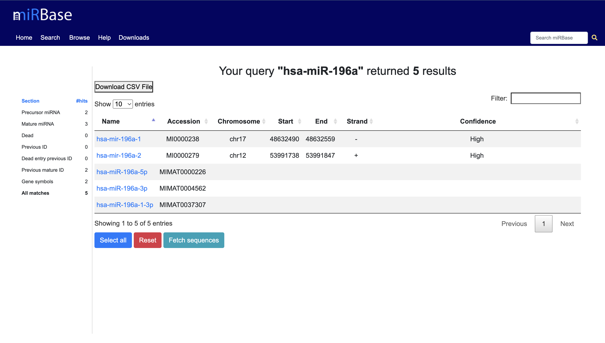
* see info on [hsa-mir-196a-1](https://www.mirbase.org/hairpin/MI0000238)
> there are two versions (see also hsa-mir-196a-2), but we are using this one today

#### A. Is miR-196a highly conserved among different species? 
* search `miR-196a`, without prefix specifying species 
* appearance across several species
  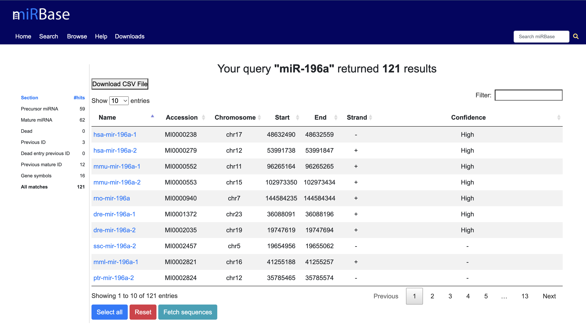
Yes, this miRNA is highly conserved in many species (e.g., in human hsa-miR-196a, in mouse 
mmu-mir-196a, etc.) 
 
#### B. Which strand of hsa-miR-196a (3p or 5p) is expressed at higher levels based on deep sequencing? 
* *sequence >> show histogram*
  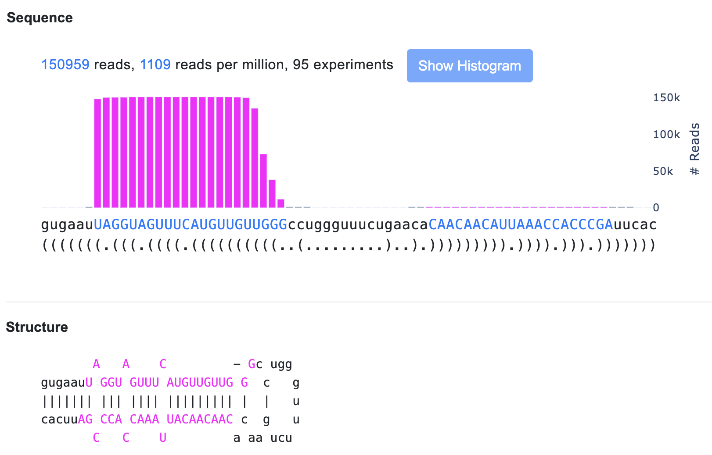
  * shows 5p -> 3p by default 
  * 5p on top row of structure, 3p on bottom row
The answer is the 5p strand (guide strand or leading strand). You can see in the deep  sequencing data >1,100,000 reads for 5p, but only few reads for 3p strand.  
 
### Q2. Go to **[TargetScan database](http://www.targetscan.org/vert_72/)** and answer the below questions about putative target genes of hsa-miR-196a-5p. 
* specify species `human` and enter miRNA name `miR-196a-5p`
  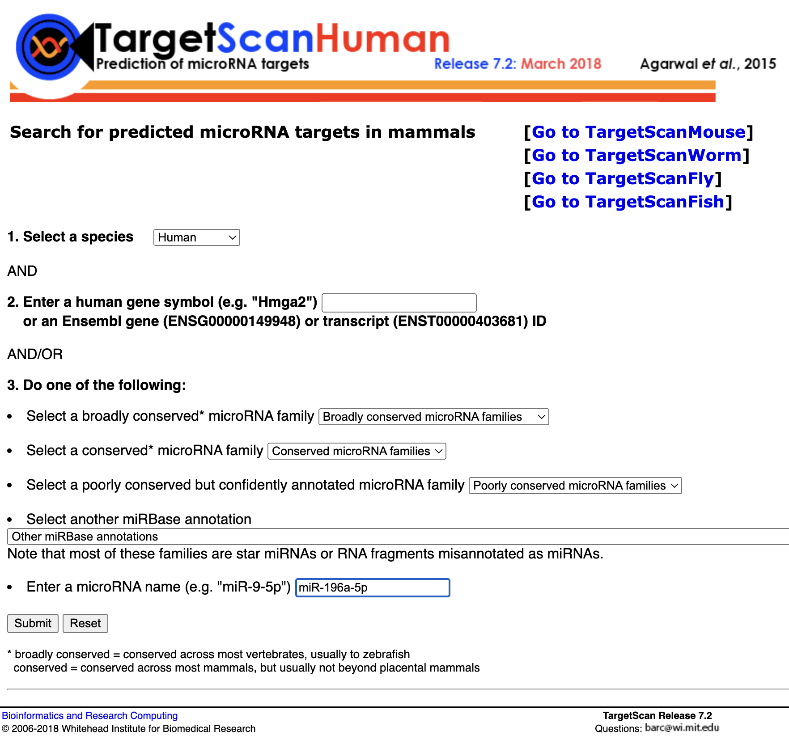
* see results 
  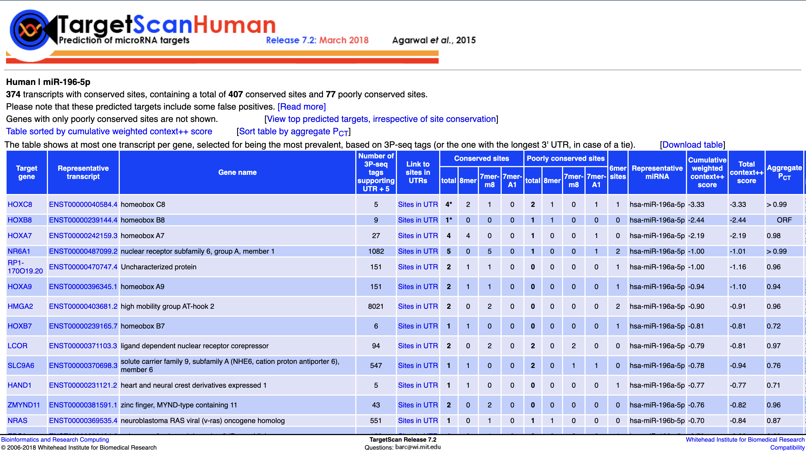
 
#### A. How many transcripts are predicted to have conserved binding sites for miR-196a-5p? 
There are 374 transcripts with conserved sites for human miR-196a-5p. 
> 374 transcripts with conserved sites, containing a total of 407 conserved sites and 77 poorly conserved sites.
 
#### B. What is the target gene of miR-196a-5p with the highest Cumulative weighted context score? 
* sorted by cumulative weighted context score (see [computation based on 14 features, weighted on site](https://www.targetscan.org/vert_72/docs/context_score_totals.html))
* negative score with largest absolute value is the most significant result
HOXC8 (homeobox C8) is the top target gene for this miRNA with score -3.33. 

### Q3. Go to **[miRNASNP database](https://guolab.wchscu.cn/miRNASNP//#!/)** and answer the below questions about SNPs in hsa-miR-196a sequence. 
* search 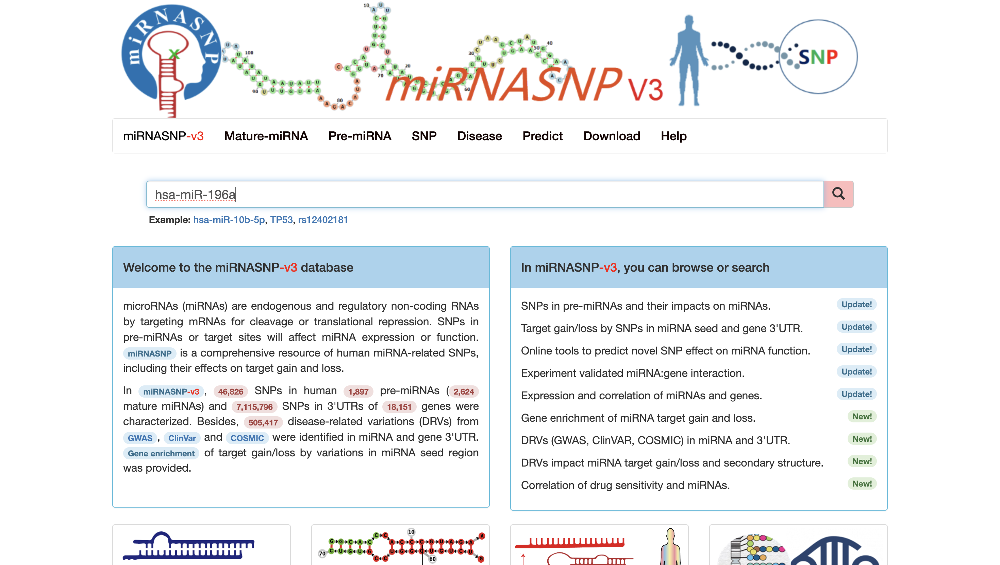
* see query results
  
 
#### A. How many SNPs are located in the mature miRNA sequence of hsa-miR-196a-3p and 5p? 
* click on link to each strand
* 3 SNPs located in seed and 7 SNPs in mature [hsa-miR-196a-3p sequence](https://guolab.wchscu.cn/miRNASNP//#!/mirna?mirna_id=hsa-miR-196a-3p)
  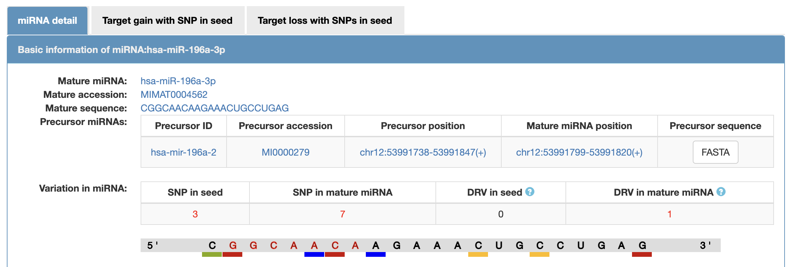
* 2 SNPs located in seed and 14 SNPs in mature [hsa-miR-196a-5p sequence](https://guolab.wchscu.cn/miRNASNP//#!/mirna?mirna_id=hsa-miR-196a-5p)  
  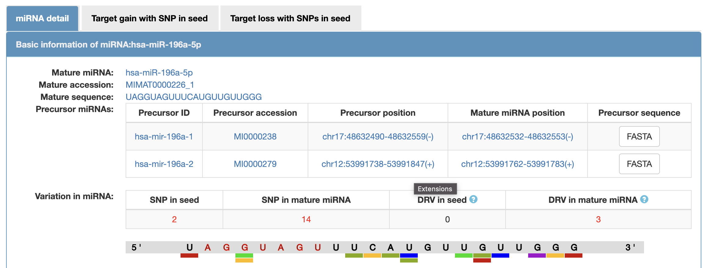
 
#### B. The SNP rs11614913 is located in the sequence related to which pre-miRNA?  
* select *SNP* from top nav bar
* enter rsID

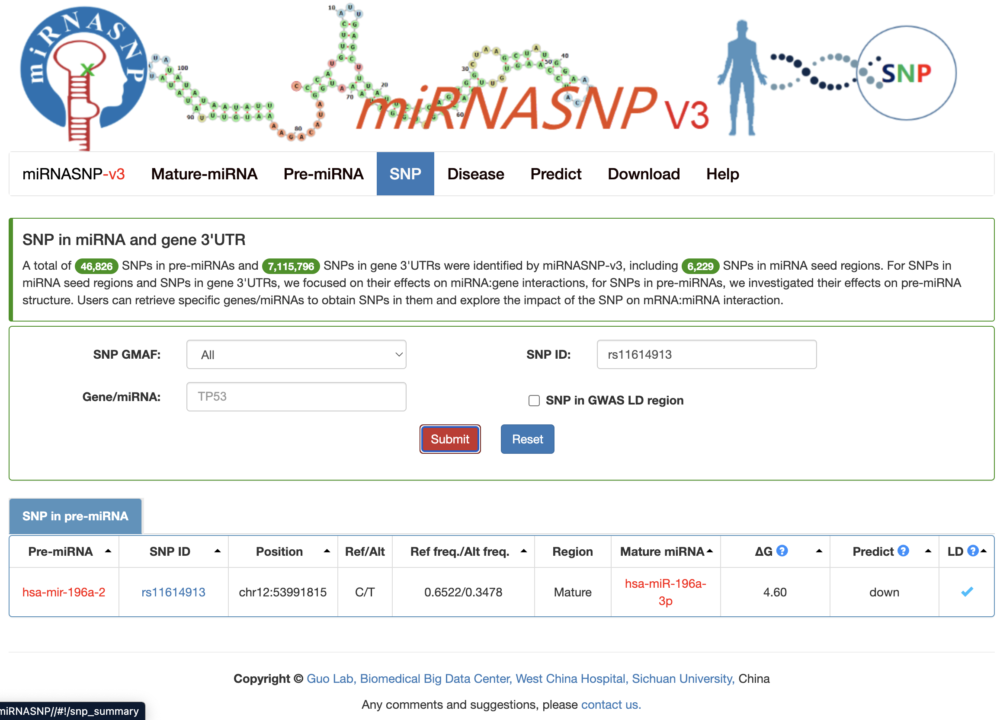
This SNP is located in hsa-mir-196a-2 
 
#### C. Which traits or diseases have been reported in the literature to be associated with the SNP rs11614913 (please mention three traits/diseases)? To answer this question you can use PubMed or **[SNPedia](https://www.snpedia.com/index.php/SNPedia)**. 

* on SNPedia, search rsID from top right search bar
  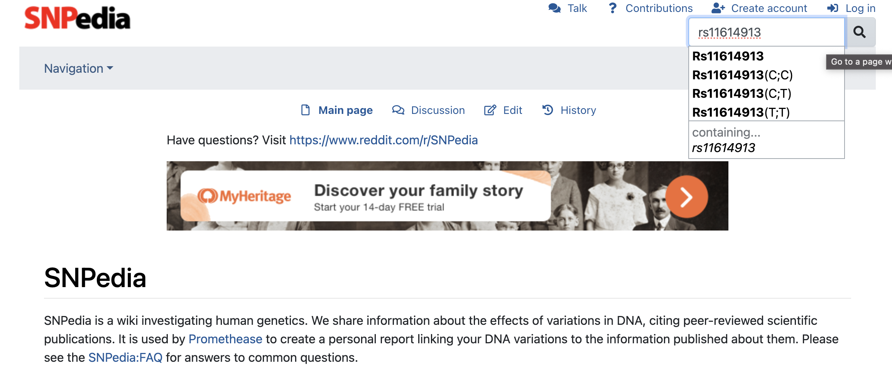

Many studies have reported the association of this SNP-miRNA with various traits and 
diseases including breast cancer, waist-to-hip ratio (central obesity), and chronic 
obstructive pulmonary disease 
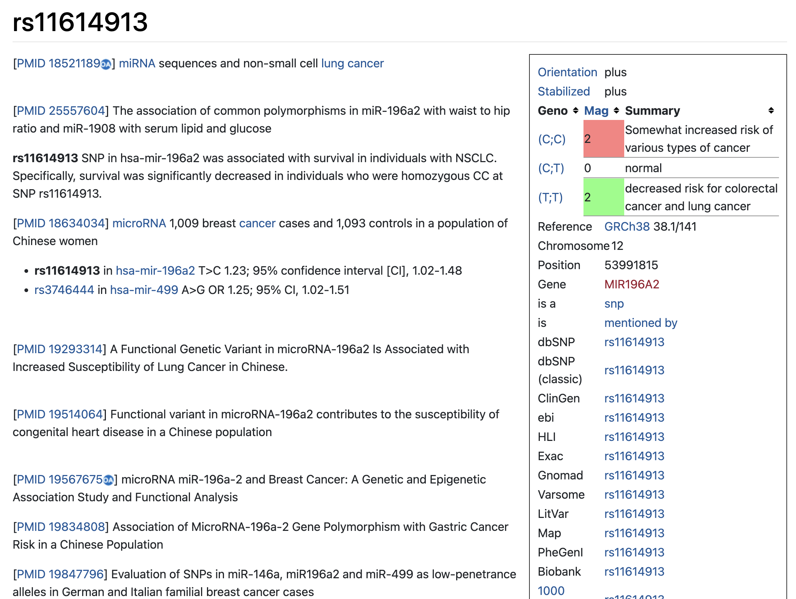

> alternatively, on [NCBI dbSNP](https://www.ncbi.nlm.nih.gov/snp/), 
> * search for SNP by rsID: [rs2910164](https://www.ncbi.nlm.nih.gov/snp/rs2910164#publications)
> * identify gene from *Gene : Consequence = MIR146A : Non Coding Transcript Variant*
> * identify associated traits/diseases reported in literature from *Publications* tab
> 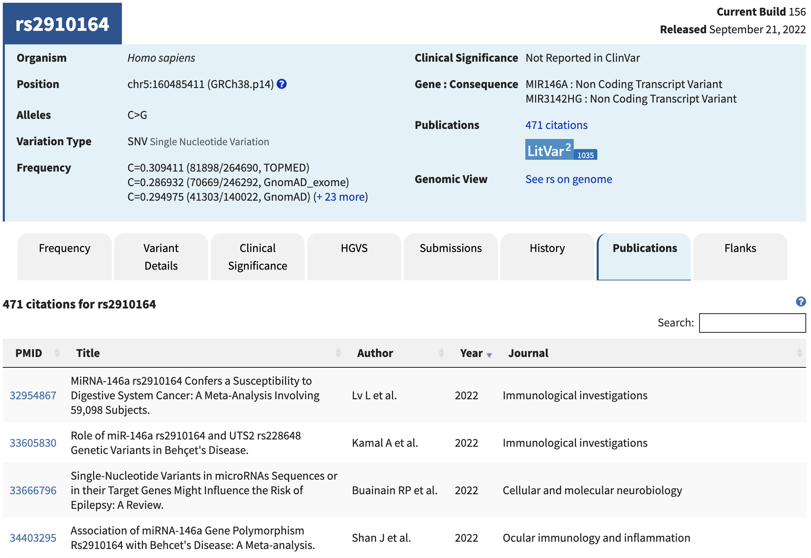
 
## Challenge
Please answer the above questions for hsa-miR-146a (Q1), miR-146a-5p (Q2) and the SNP rs2910164 (Q3). 
 
### Q1. **[miRbase database](http://www.mirbase.org/)**: hsa-miR-146a

#### A. Is hsa-miR-146a highly conserved among different species? 
This miRNA is also highly conserved in many species (e.g., in human hsa-miR-146a, in mouse mmu-mir-146a, etc.) 
* search `miR-146a`
* found in many species
  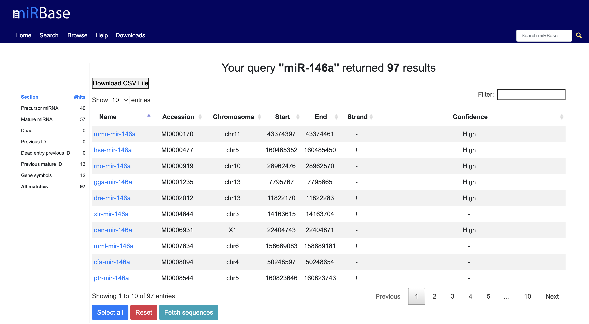

#### B. Which strand of hsa-miR-146a (3p or 5p) is expressed at higher levels based on deep sequencing? 
The 5p strand (guide strand or leading strand) is expressed at higher levels, you can see in the deep sequencing data >1,355,000 reads for 5p and few reads for 3p strand. 
* click on [hsa-mir-146a](https://www.mirbase.org/hairpin/MI0000477)
* *sequence >> show histogram*
  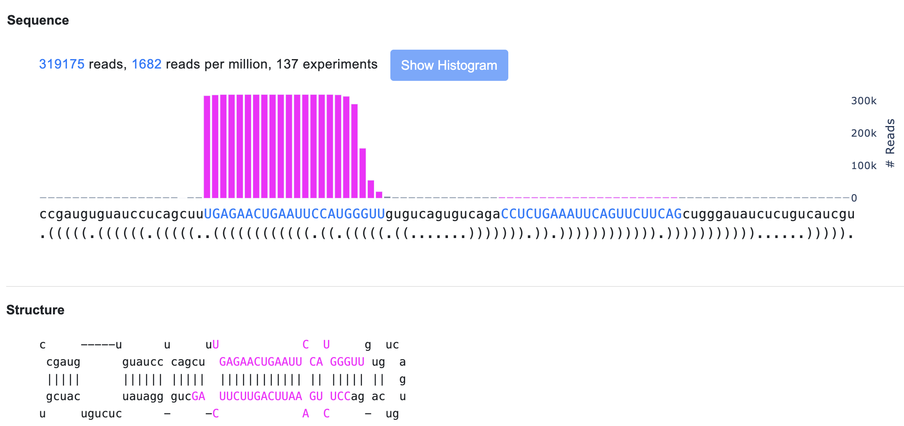

### Q2. **[TargetScan database](http://www.targetscan.org/vert_72/)**: miR-146a-5p
* select human species
* enter miRNA name miR-146a-5p

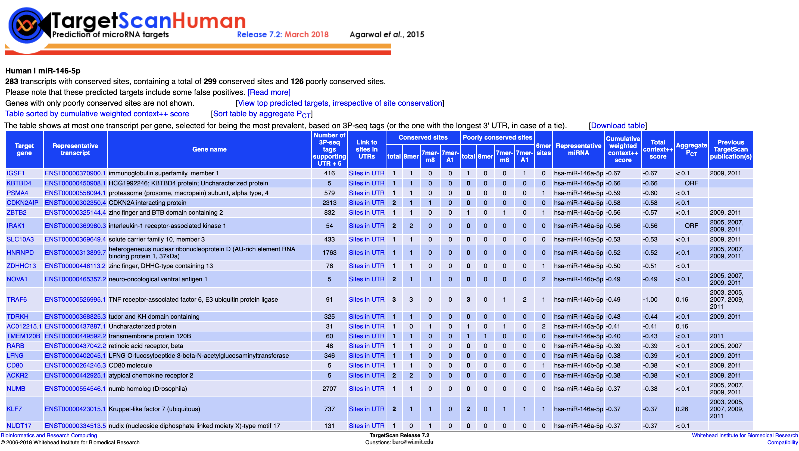

#### A. How many transcripts are predicted to have conserved binding sites for miR-146a-5p? 
There are 283 transcripts with conserved sites for human miR-146a-5p. 

#### B. What is the target gene of miR-146a-5p with the highest Cumulative weighted context score? 
IGSF1 (immunoglobulin superfamily, member 1) is the top target gene for this miRNA, with score -0.67. 

### Q3. **[miRNASNP database](https://guolab.wchscu.cn/miRNASNP//#!/)**: rs2910164 

#### A. How many SNPs are located in the mature miRNA sequence of hsa-miR-146a-3p and 5p? 
There are 3 SNPs located in seed and 7 in mature hsa-miR-146a-3p sequence.
There are no SNPs in seed and 6 SNPs located in mature hsa-miR-146a-5p sequence. 
* search for hsa-miR-146a
  
* see [3p](https://guolab.wchscu.cn/miRNASNP//#!/mirna?mirna_id=hsa-miR-146a-3p)
  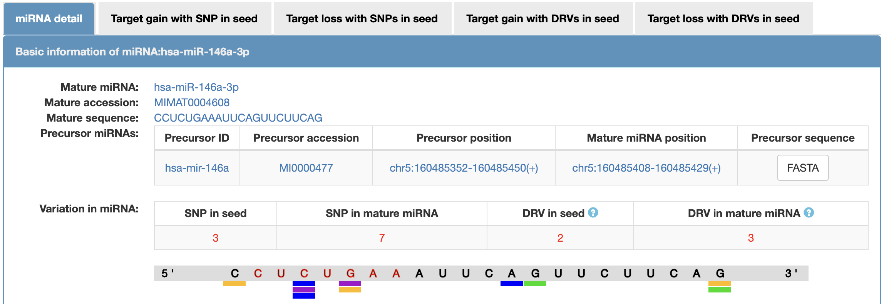
* see [5p](https://guolab.wchscu.cn/miRNASNP//#!/mirna?mirna_id=hsa-miR-146a-5p)
  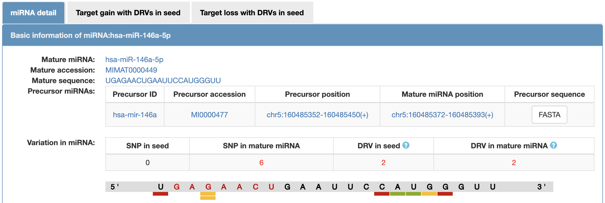

#### B. The SNP rs2910164 is located in the sequence related to which pre-miRNA? 
The SNP rs2910164 is located in seed region of hsa-miR-146a-3p. 
* in SNP tab, search rsID
  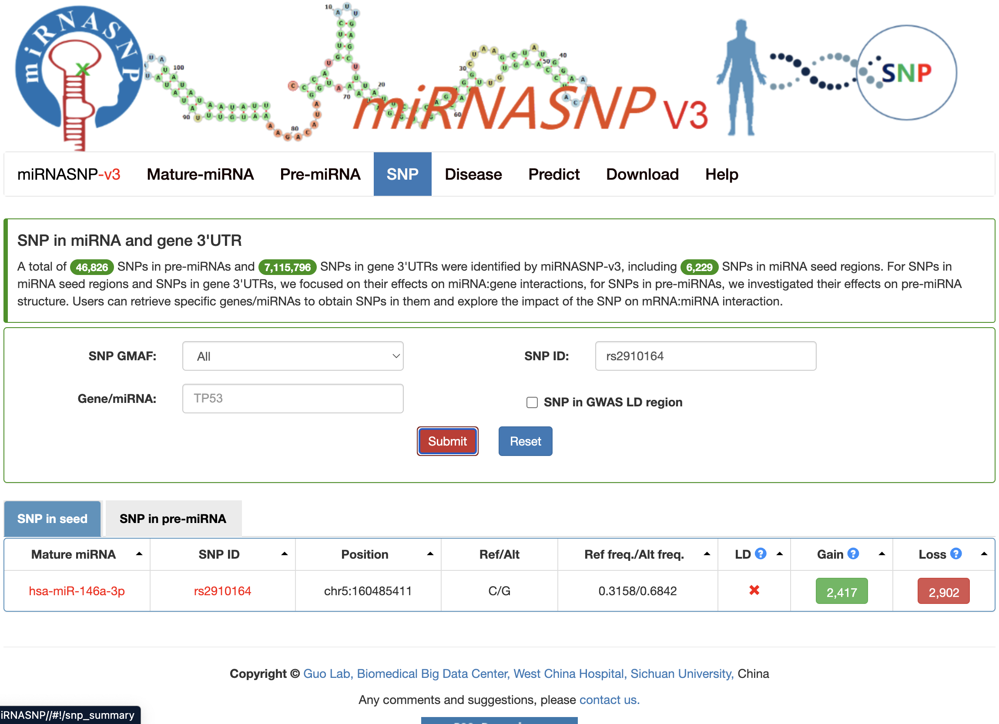 

#### C. Which traits or diseases have been reported in the literature to be associated with the SNP rs2910164 (please mention three traits/diseases)? To answer this question you can use PubMed or SNPedia (https://www.snpedia.com/index.php/SNPedia). 
Many studies have reported the association of rs2910164 with various types of cancers including breast cancer, lung cancer, and carcinoma of the head and neck.

* search rsID on SNPedia: [rs2910164](https://www.snpedia.com/index.php/Rs2910164)
* see associated traits
  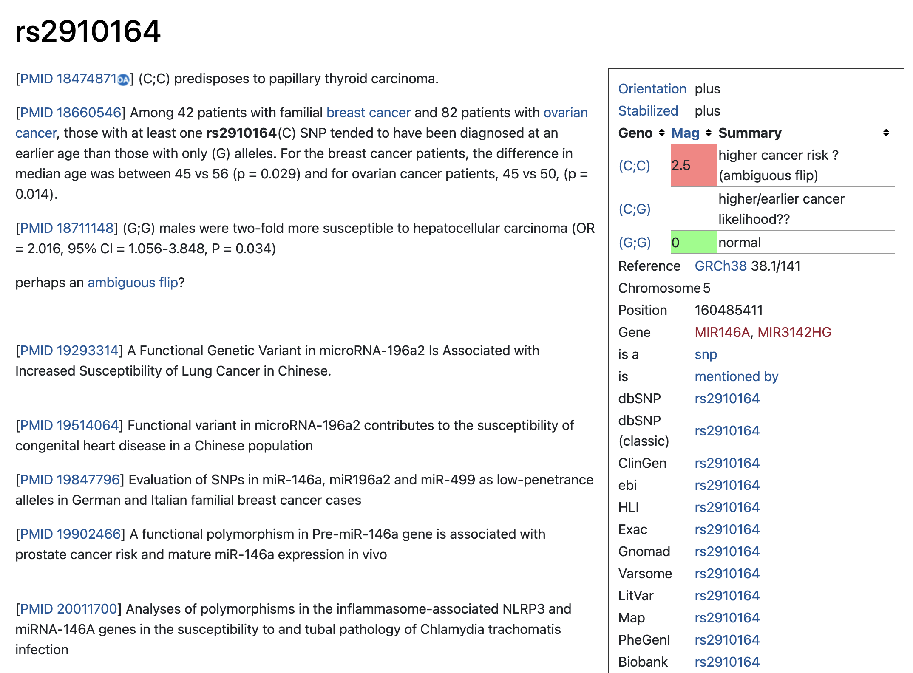

